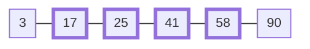
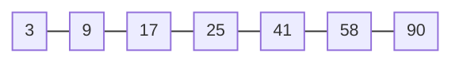
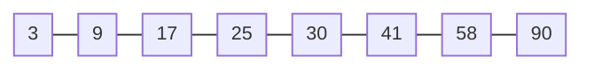
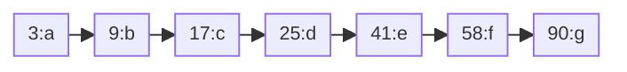
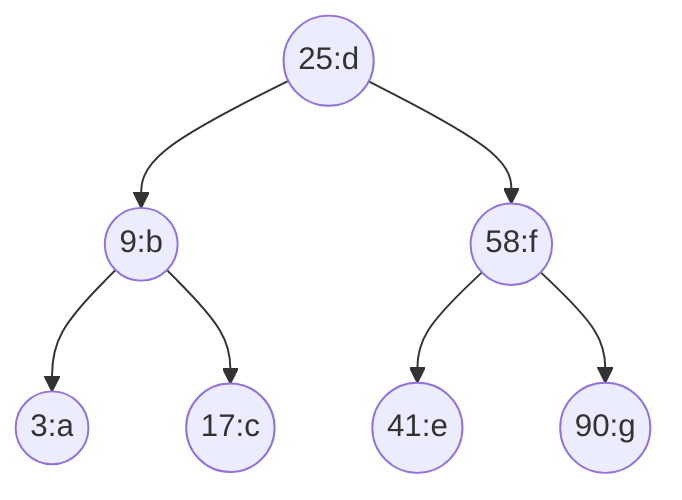
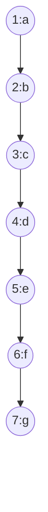
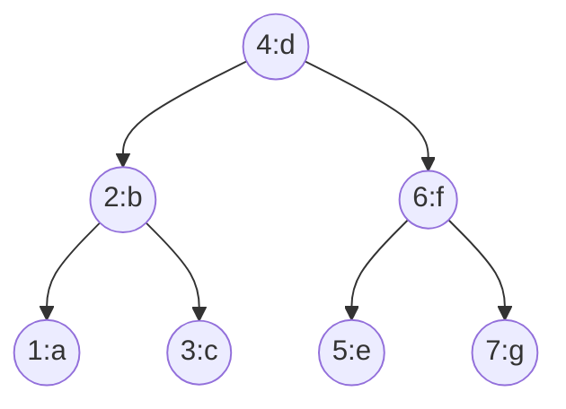

# Why Keep Data Sorted: From Binary Search to Self-Balancing Trees

This is Part 2 of a four-part series on why data structures exist. Part 1 ended with the hash map: $O(1)$ point lookups, achieved by deliberately scattering keys. This part is about the queries that scattering breaks — and the structures invented to answer them.

## Queries That Are Not Points

Many real queries name a *region* of keys, not one key:

- All events with a timestamp between two dates.
- All order IDs from 4000 to 5000.
- The 10 largest scores.
- All entries, in key order.

The general form is the **range query**: return every entry with a key in `[a, b]`.

A hash map has no answer except a full scan. Keys 41 and 42 sit in unrelated slots, so nothing short of visiting every entry finds "all keys between 40 and 90." Cost: $O(n)$, for every single query.

## Why Not Sort on Demand?

Sorting the entries when a range query arrives costs $O(n \log n)$ — *worse* than the $O(n)$ scan it was meant to avoid. Sorting only pays off if its cost is spread across many queries.

Part 1 adds a harder constraint: on storage, sorting on the fly is not a per-query tool at all — it is a multi-pass batch job. Data that lives on disk must be organized before the query arrives.

Both arguments point at the same conclusion: **don't sort per query. Keep the data sorted at all times.**

## What Sorted Order Buys

With entries maintained in key order:

- **Point lookup:** binary search, $O(\log n)$.
- **Range query `[a, b]`:** binary search to the first key ≥ a, then walk forward until the key exceeds b. $O(\log n + k)$, where k is the number of results.
- **Sorted iteration:** already sorted. $O(n)$ with no extra work.
- **Min / max:** first and last entry. $O(1)$.

*Range query [17, 58]: one binary search, then a short walk. The scattered hash map cannot do this.*

The rest of this article is about the price: **maintaining** sorted order while data changes. That single requirement generates every structure below.

## Binary Search

Start where sorted order performs best: the sorted array. As in Part 1, the array's key is its index; here the *entries* are additionally sorted by their data key, and binary search operates on those keys.

Compare the target key against the middle entry's key. If the target is smaller, it can only be in the left half. If larger, only in the right half. Repeat on the remaining half until the key is found or the range is empty.

Each comparison halves the search space. An array of `n` entries needs at most $\log_2(n)$ comparisons. One million entries: 20 comparisons.

Time: $O(\log n)$. Space: $O(1)$.

Two properties make this possible:

- **Sorted order.** One key comparison against the middle entry tells us which half to discard.
- **Indexing.** Accessing the middle entry is $O(1)$, via the array's built-in key — the index.

Remove either property and binary search stops working.

## Arrays Become Expensive

Arrays are efficient while the data is static. They become expensive when the data changes.

To insert an entry into a sorted array, we must place it at its sorted position. Every entry after that position shifts one slot right.

Before inserting key 30 (diagrams show keys only; positions 0–6 are the implicit array keys):

After — 41, 58, and 90 shifted right, so their positions all changed:

Deletion shifts entries left. Both operations move $O(n)$ entries in the worst case. If the array's capacity is full, insertion also requires allocating a larger array and copying all entries.

So a sorted array gives $O(\log n)$ search but $O(n)$ insert and delete. For workloads with frequent insertions and deletions, maintaining sorted order is the bottleneck. The array itself is the problem, so we change the underlying structure.

## Linked Lists

A singly linked list stores each entry in a separate node. Each node holds the key, its value, and a pointer to the next node. The key now lives *inside* the node — there is no index mapping a position to an entry. From here on, diagrams show nodes as `key:value` to make that explicit.

Nodes are not contiguous in memory. This changes the costs:

- **Insertion:** given the previous node, create a node and update one pointer. $O(1)$. No shifting, no capacity limit.
- **Deletion:** given the previous node, bypass one pointer. $O(1)$.
- **Traversal:** to reach position `k`, follow `k` pointers from the head. $O(k)$.

There is no random access. Indices do not exist. Reaching the middle of `n` nodes costs $O(n/2)$ — the same order as scanning the whole list.

Binary search fails here, and the reason matters. The list can be kept sorted, so ordering is intact. **The missing property is indexing.** Without $O(1)$ access to the middle, discarding half the entries saves nothing, because reaching the middle already cost $O(n)$.

| | Sorted array | Sorted linked list |
|---|---|---|
| Search | $O(\log n)$ | $O(n)$ |
| Insert (at known position) | $O(n)$ | $O(1)$ |
| Delete (at known position) | $O(n)$ | $O(1)$ |

Each structure satisfies one of binary search's two requirements and violates the other.

## Can We Skip Half Without an Array?

The question: can we keep eliminating half the search space without array indices?

Observe what binary search actually uses `mid` for. It jumps to the middle, compares, and then only ever moves to the middle of the smaller half or the middle of the larger half. For a fixed dataset, this sequence of jumps never changes.

If the jumps never change, we can store them as pointers instead of recomputing them from indices. Give each node two outgoing pointers instead of one: one pointing toward smaller keys, one pointing toward larger keys.

Start at the node binary search would visit first — the overall middle. Comparing against it tells us which pointer to follow, and following it discards the other half. Physical position is no longer needed. The ordering is encoded in the links themselves.

## Binary Search Trees

This structure is a **Binary Search Tree (BST)**. The conventional names are `left` and `right`:

- Every key in the left subtree is less than the node's key.
- Every key in the right subtree is greater than the node's key.

This rule holds at every node, not just the root.

**Lookup** is binary search expressed as a traversal. Start at the root. If the target key equals the current node's key, return its value. If smaller, follow the left pointer; if larger, follow the right pointer. Each step discards an entire subtree — half the remaining data in a balanced tree.

Time: $O(h)$, where h is tree height. Space: $O(1)$.

**Insertion** follows the same path lookup would take, then attaches a new node at the empty position it reaches. One pointer assignment — the linked list's cheap update.

**Deletion** removes a node and reconnects its children; when a node has two children, it is replaced by its in-order successor. The cost is one root-to-target walk.

**Range queries** work too: find the first key ≥ a, then visit keys in order (in-order traversal) until the key exceeds b. $O(h + k)$.

All single-entry operations walk one root-to-leaf path, so all cost $O(h)$. For a tree that branches evenly, $h \approx \log_2(n)$, giving **$O(\log n)$ average** for search, insert, and delete.

## The Problem with BSTs

A BST's shape depends on insertion order. Insert keys `1 2 3 4 5 6 7` in that order. Every new key is greater than all existing keys, so every insertion goes right:

No node has a left child. This tree has height `n`, and each comparison eliminates one entry instead of half. Every $O(h)$ operation becomes **$O(n)$**. Structurally, this is a singly linked list.

Sorted or nearly sorted input is common in practice: auto-incrementing IDs, timestamps, imported data. So this is a normal case, not an edge case.

The conclusion: the data structure alone is not enough. **Its shape matters.** The BST's invariant (left < node < right) guarantees ordering, but nothing guarantees logarithmic height.

## Self-Balancing Trees

The missing property is a height guarantee. A self-balancing tree restores it by restructuring itself during insertions and deletions, with the objective: **maintain height $O(\log n)$ at all times.**

The same input as above — keys `1 2 3 4 5 6 7` — inserted into a self-balancing tree produces height 3 instead of height 7:

The ordering rule (left < node < right) still holds at every node. Only the shape changed.

Rebuilding the whole tree after each insertion would cost $O(n)$ per operation — the array's problem again. Instead, balancing is local. The tree applies **rotations**: small, constant-time pointer changes along the insertion path that reduce height while preserving the left < node < right ordering. We will not cover rotation mechanics here; what matters is that they are $O(1)$ each and at most $O(\log n)$ of them run per operation.

**AVL trees** store a height on each node and require that the left and right subtree heights of every node differ by at most 1. Any violation is fixed immediately by rotation. This keeps the tree strictly balanced: search is as fast as possible, at the cost of more rotation work on every write. Suited to read-heavy workloads.

**Red-Black trees** enforce a weaker invariant through node coloring rules: the longest root-to-leaf path is at most twice the shortest. Fewer rotations per write, slightly taller tree. Suited to write-heavy workloads, which is why they back the ordered map implementations in most standard libraries.

Both guarantee **$O(\log n)$ worst case** for search, insert, and delete.

## Complexity Table

| Operation | Hash map | Array (sorted) | Linked List | BST | AVL Tree |
|---|---|---|---|---|---|
| Point lookup | $O(1)$ avg | $O(\log n)$ | $O(n)$ | $O(n)$ worst, $O(\log n)$ avg | $O(\log n)$ |
| Range query | $O(n)$ | $O(\log n + k)$ | $O(n)$ | $O(h + k)$ | $O(\log n + k)$ |
| Insert | $O(1)$ avg | $O(n)$ | $O(1)$* | $O(n)$ worst, $O(\log n)$ avg | $O(\log n)$ |
| Delete | $O(1)$ avg | $O(n)$ | $O(1)$* | $O(n)$ worst, $O(\log n)$ avg | $O(\log n)$ |
| Random access | — | $O(1)$ | $O(n)$ | — | — |

\* At a known position; reaching that position costs $O(n)$.

Space is $O(n)$ for all five. The linked list adds one pointer per entry; the trees add two pointers per entry, plus one height or color field for AVL and Red-Black trees.

## Summary

- **Hash map** → point lookups, no order.
- **Sorted array** → order and random access, expensive mutation.
- **Linked List** → cheap structural updates, no indexing.
- **BST** → ordered search without indexing.
- **AVL / Red-Black** → guaranteed logarithmic performance.

Every data structure exists because the previous one failed to satisfy a new requirement. Understanding those requirements is more valuable than memorizing the structures themselves.

What we built is an ordered key-value store with logarithmic operations — *in memory*. Part 3 moves it to disk, where Part 1's hardware constraints return: jumping is expensive, blocks are the unit of access, and the balanced binary tree stops being the right shape.
