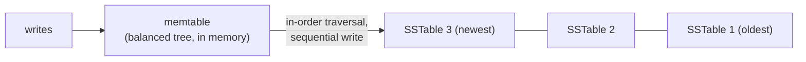
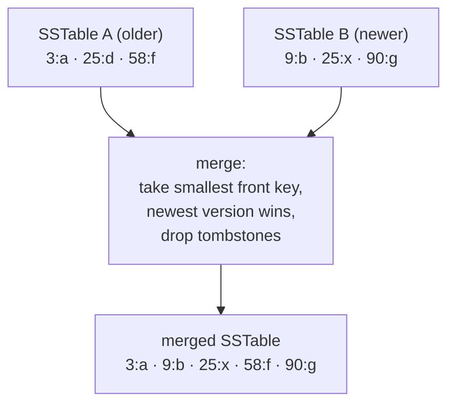

# Sorted on Disk: Memtables, SSTables, and Compaction

This is Part 3 of a four-part series on why data structures exist. Part 2 ended with an ordered key-value store that does everything in $O(\log n)$ — in memory. This part moves it to disk, where the hardware rules from Part 1 return: blocks are the unit of access, and random jumps are the most expensive thing you can do.

## Why the Balanced Tree Fails on Disk

Put an AVL tree on disk and every pointer hop becomes a random block read.

A lookup in a million entries takes ~20 hops. In memory that is 20 cheap jumps. On disk it is 20 random block reads — on a hard disk, 20 mechanical seeks for a single lookup. Worse, each block read fetches 4 KB to inspect one small node: almost all of the block is wasted.

Writes are worse still. Insertions rebalance the tree with rotations — small pointer updates scattered across the structure. On disk, that is random writes at random locations, the exact pattern storage punishes.

The requirements from Part 2 haven't changed: sorted order, logarithmic search, cheap updates. The failing property is new: **the structure assumes uniform-cost access, and disk doesn't provide it.**

There are two known answers. One reshapes the tree to match the block size — nodes with hundreds of children instead of two — producing the B+Tree, the structure behind most relational database indexes. This article follows the other answer, the one behind most modern key-value stores: **stop updating disk in place entirely.**

## The Design Rule: Sequential Writes Only

From Part 1: storage rewards exactly two patterns — sequential writes and block-sized reads of neighbors. So we adopt a rule that sounds too strict to work:

**Never modify a file on disk. Only write new files, sequentially, and only read sorted files.**

Everything below is the consequence of taking this rule seriously.

## Step 1 — Absorb Writes in Memory

Incoming writes cannot go to disk in sorted position (that would be in-place modification). So they go to memory first, into a small balanced tree — exactly Part 2's structure, now with a job title: the **memtable**.

Every put and delete inserts into the memtable in $O(\log m)$, where m is the memtable's size. Order is maintained on arrival, in the one place where random access is free.

## Step 2 — Flush: In-Order Traversal Becomes a Sorted File

When the memtable reaches a size limit, walk it with an **in-order traversal** — visit left subtree, node, right subtree, recursively. In-order traversal of a search tree emits every entry in ascending key order, in $O(m)$.

Stream that traversal straight to disk. The result is a file of key-value entries, already sorted, written in one sequential pass — a **sorted segment file**, commonly called an **SSTable** (Sorted String Table). Once written, it is immutable: never edited, only eventually replaced.

This is the bridge between the two worlds: the tree keeps order using cheap random access in memory; the traversal serializes that order onto disk using one cheap sequential write. Neither side is ever asked to do what its hardware is bad at.

Deletions follow the same path: a delete writes a **tombstone** — an entry marking the key as deleted — because we cannot reach into old files and remove anything.

## Reading Across Segments

A point lookup now checks places in order of freshness: memtable first, then the newest SSTable, then older ones. The first version of the key found wins — newer files shadow older ones.

Within one SSTable, the file is sorted, so binary search applies. In practice a small in-memory index of every few blocks reduces this to: one index lookup, one block read.

Cost: $O(\log m)$ for the memtable plus $O(\log s)$ per segment, for k segments. And there is the problem: **k grows with every flush.** Ten segments means up to ten reads per lookup. Reads degrade as write history accumulates.

The same key may also exist in five segments with five stale values, and tombstones pile up. Disk fills with dead data.

## Compaction: The Second Half of Merge Sort

Merge sort has two halves. The first half splits and sorts. The second half — **merging sorted runs** — is the one that matters here, because our flushes already produced the sorted runs.

Merging k sorted files needs no random access at all. Keep one read position at the front of each file. Repeatedly take the smallest key among the fronts, write it to the output, advance that file's position:

When the same key appears at multiple fronts, keep the newest version and discard the rest. If the newest version is a tombstone, discard the key entirely. The output is one larger SSTable with no duplicates and no dead entries.

Every read in this process is sequential. Every write is sequential. Memory needed: one block per input file, regardless of file sizes — this works on files a thousand times larger than RAM. Cost: $O(\text{total entries})$, streamed. This is why the merge step, not the tree, is the workhorse of storage engines: it is the one sorting tool whose access pattern is exactly what disk rewards.

## Background Workers

Compaction does not happen on the query path. **Background workers** continuously pick groups of SSTables — typically overlapping ones, or many small ones — merge them into fewer, larger, cleaner files, and delete the inputs. Meanwhile the memtable keeps absorbing writes and flushing new segments.

The system is a steady state: writes push unsorted-by-arrival data in at the top, and workers grind it into fewer, larger sorted files at the bottom. Reads get faster as k shrinks; writes never wait for it.

The price is **write amplification**: each entry is rewritten every time a compaction touches its file, so one logical write becomes several physical ones over its lifetime. That is the trade against in-place structures, and tuning it is most of the engineering in real storage engines.

This whole architecture — memtable, SSTables, compaction — is the **Log-Structured Merge tree (LSM tree)**. It backs many of the most widely used key-value stores and database storage engines.

## Cost Summary

| Operation | Where it runs | Cost |
|---|---|---|
| Write / delete | memtable | $O(\log m)$, memory only |
| Flush | traversal → disk | $O(m)$, one sequential write |
| Point lookup | memtable + k segments | $O(\log m + k \log s)$, block reads |
| Range query | k-way merge over segments | $O(\log + \text{results})$, mostly sequential |
| Compaction | background workers | $O(\text{total entries})$, fully sequential |

## Summary

- **Balanced tree on disk** → random reads and writes; the shape fights the hardware.
- **Memtable** → order is maintained in memory, where random access is free.
- **Flush** → in-order traversal turns a tree into a sorted file with one sequential write.
- **SSTables** → immutable sorted segments; reads use binary search within each.
- **Compaction** → merge sort's second half, run forever by background workers, keeps segment count and dead data down.

The series in one line each: the array gave us computed lookups; the hash map generalized them to any key but destroyed order; sorted structures restored order for range queries; balanced trees kept order cheap under change; and on disk, where jumping is expensive, we keep order by writing sorted runs and merging them — never by editing in place.

Every structure exists because the previous one failed a requirement the hardware or the workload imposed. The requirements are the thing worth remembering.
