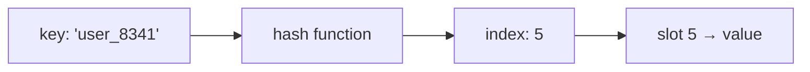

# Point Lookups: Hash Maps and the Hardware Beneath Them

This is Part 1 of a four-part series on why data structures exist. This part covers the simplest question a data structure can answer — *given a key, return its value* — and the hardware that determines what answering it costs.

## The Array

An array is a contiguous block of memory divided into equal-sized slots. Slot `i` lives at a computed address: `base_address + i × slot_size`.

That formula is the array's defining property. Reading or writing slot `i` requires no searching — the location is arithmetic. Get and put by index: $O(1)$. Space: $O(n)$.

Look at what the array is actually doing: it maps an integer to a value. Give it `4`, it returns the value in slot 4. The index behaves like a key — one that is never stored anywhere, because it is computed from the layout itself.

## Associative Arrays

This pattern — *given a key, return its value* — has a name. An **associative array** is a collection of key-value entries with three operations:

- **put(key, value)** — store an entry.
- **get(key)** — return the value for an exact key. This is a **point lookup**.
- **delete(key)** — remove an entry.

The plain array is an associative array with one restriction: keys must be the integers `0` to `n−1`.

The restriction is severe. Real keys are IDs, names, timestamps — not dense integers starting at zero. We want the array's $O(1)$ arithmetic lookup, but for arbitrary keys. Every structure in this series implements the associative array interface; they differ only in what each operation costs.

## The Hash Map: An Array for Arbitrary Keys

A **hash map** removes the restriction while keeping the arithmetic. A **hash function** converts any key into an integer, and that integer is used as an index into an ordinary array underneath:

A point lookup becomes: hash the key, jump to the computed slot, compare, return.

Two keys can hash to the same index — a **collision**. The standard fix is to let each slot hold a small list of entries and to grow the array when slots get crowded. With a good hash function, each slot stays near one entry.

Time: $O(1)$ average for get, put, and delete; $O(n)$ worst case if collisions pile up. Space: $O(n)$.

This is why a hash map *is* an associative array in the literal sense: it is a plain array plus a function that turns arbitrary keys into array indices. The array's hidden key has been generalized, not replaced.

## Why $O(1)$ Is Physically Possible: RAM

The hash map's $O(1)$ rests on a hardware assumption: **jumping to an arbitrary memory address costs the same as jumping to a neighboring one.**

In RAM this is true by construction. An address is a pattern of bits on the address bus. A decoder circuit routes the request to the selected cell. Changing the address means changing which bits are set — there is no physical movement, no travel distance. Address 7 and address 7,000,000 are reached in the same time. That is what "random access" in Random Access Memory means.

One honest caveat: modern CPUs read memory through caches in 64-byte lines, so *nearby* addresses are cheaper in practice than scattered ones. The uniform-cost model is an approximation — but a useful one, and it is the model hash maps are designed for.

## Storage Is a Different Machine

Disks do not offer uniform-cost access.

Storage reads and writes happen in **blocks** (typically 4 KB), not bytes. And the cost gap between access patterns is large:

| Access | Approximate latency |
|---|---|
| RAM read | ~100 nanoseconds |
| SSD random block read | ~100 microseconds |
| HDD random block read (seek) | ~5–10 milliseconds |

A random read on an HDD is roughly **100,000× slower** than RAM, because a mechanical arm physically moves to the data. SSDs remove the mechanics but keep the block granularity, and sequential reads remain several times cheaper than random ones on both.

The rule that falls out: **in memory, jumping anywhere is free; on storage, jumping is the most expensive thing you can do.** Storage rewards reading neighbors; memory doesn't care.

## Why "Just Sort It When Needed" Fails on Storage

This difference decides where computation can be casual and where it must be planned.

**In memory**, sorting `n` entries costs $O(n \log n)$ comparisons, and every access during the sort is a cheap random jump. Sorting a million entries on demand is a routine, sub-second operation.

**On storage**, the same sort is a different problem entirely:

- Every comparison touches a block, not a byte.
- Sorting inherently moves entries far from their original positions — a random-access-heavy workload, the exact pattern storage punishes.
- Datasets on disk are usually larger than RAM, forcing external sorting: multiple complete read-and-write passes over the entire dataset.

Sorting on the fly in memory is a tool you can reach for per query. Sorting on the fly on disk is a batch job. Any structure that lives on storage must therefore be **organized before the query arrives** — the layout is the plan, and it cannot be recomputed casually. This single constraint shapes every disk-based data structure that exists.

## What the Hash Map Cannot Do

A good hash function scatters keys *uniformly on purpose* — that is what keeps slots evenly filled. But scattering destroys order. Keys 41 and 42 land in unrelated slots.

So a hash map answers exactly one question: *the value for this exact key*. It cannot answer:

- all keys between 40 and 90,
- the entries in sorted order,
- the smallest or largest key,

except by scanning everything: $O(n)$.

Point lookups are solved. **Part 2 asks what happens when the query is not a point** — and why the answer is to keep data sorted at all times.
