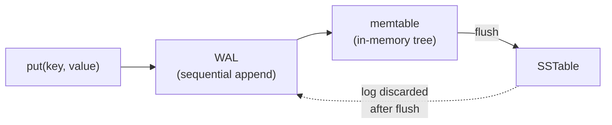
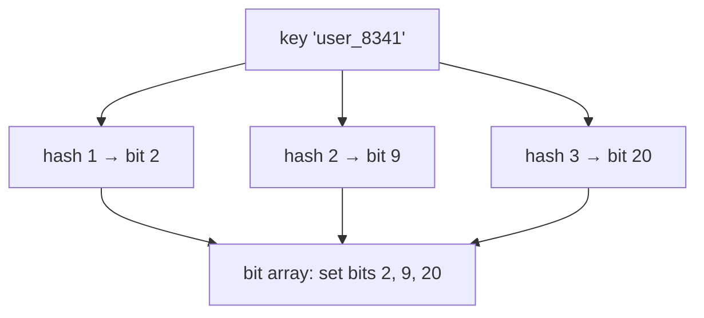

# High-Volume Writes: The Write-Ahead Log and Bloom Filters

This is Part 4 of the series on why data structures exist. Part 3 built the LSM tree: memtable, SSTables, compaction. It left two problems open. First, the write path keeps data in memory — what happens when the machine crashes? Second, a read problem hiding in plain sight: the **empty read** — paying full disk cost to look up a key that does not exist and getting nothing back.

## What Makes Writes Fast — and What Makes Them Unsafe

Recall the write path from Part 3: a put goes into the memtable, an in-memory balanced tree. $O(\log m)$, no disk involved. Flushes and compactions happen later, off the write path, as sequential I/O.

This is already the recipe for high write volume: **the write path contains no random disk I/O at all.** Compare an in-place structure like an on-disk B+Tree, where a single write must first find the right block (several random reads) and then rewrite it (a random write). The LSM write path skips all of it.

But it has a hole. Memory is volatile. A crash between two flushes loses every write the memtable held — possibly thousands of acknowledged operations. Durability is the missing property.

The fix must not reintroduce random I/O, or the whole design collapses. Part 1 tells us what disk does cheaply: append to the end of a file.

## The Write-Ahead Log

Before a write enters the memtable, append it to a plain file on disk: the **write-ahead log (WAL)**. The log is not sorted, not indexed, never read during normal operation. It is only an ordered record of what happened, written the only way disk likes: sequentially, at the end.

The full write path is now: one sequential append, one in-memory tree insert, acknowledge. Still no random I/O.

After a crash, replay the log from the start, re-inserting each entry into a fresh memtable. The memtable is rebuilt exactly; nothing acknowledged is lost. Once a memtable flushes to an SSTable, its log segment is deleted — the SSTable is the durable copy now.

One more throughput lever: forcing every single append to physical disk (a sync) is expensive, so engines batch them — many concurrent writes share one sync. This is **group commit**. Throughput rises with load, which is the opposite of what most systems do under pressure.

Time per write: $O(\log m)$ memory work + an amortized sequential append. This is how storage engines absorb hundreds of thousands of writes per second on ordinary disks.

## The Empty Read: The Most Expensive Way to Find Nothing

Part 3's lookup checks the memtable, then SSTables newest to oldest, stopping at the first hit.

Now look up a key that **does not exist**. There is no first hit. The search cannot stop early — it must check the memtable and *every* segment before it can say "not found." This is an **empty read**: k segments, k block reads, and the answer is nothing.

Note the asymmetry. A successful lookup stops at the first hit and often touches one file. An empty read always does the *maximum* work, and produces zero bytes of useful output. The lookups that return nothing are the ones that cost the most.

And empty reads are a routine workload, not an edge case: checking whether a username is taken, cache lookups that mostly miss, deduplicating incoming records. Some systems read absent keys more often than present ones — their disks would spend most of their time proving that nothing is there.

The requirement: prove a key is absent from a file **without reading the file**. Prevent the empty read from ever reaching disk.

## Bloom Filters

A **Bloom filter** is a small in-memory structure that answers one question about a set: *is this key possibly in the set, or definitely not?*

It is a bit array plus a handful of hash functions — hashing again, Part 1's tool reused for a new job. When an SSTable is built, every key is run through the hash functions, and each function sets one bit:

To ask whether a key might be in the file, hash it the same way and check its bits:

- **Any bit is 0** → the key was never inserted. **Definitely absent.** Skip the file.
- **All bits are 1** → the key is *probably* present — or other keys happened to set those same bits, a **false positive**. Read the file to find out.

The two guarantees that matter:

- **No false negatives.** The filter never says "absent" for a present key. Skipping a file is always safe.
- **Tunable false positives.** At roughly 10 bits of memory per key, about 1% of absent-key checks wrongly trigger a file read. More bits, fewer mistakes.

Each SSTable gets its own filter, built once at flush or compaction time and kept in memory. Immutability pays again: the file never changes, so the filter never needs updating.

Time per check: $O(1)$ — a few hashes and bit reads. Space: ~1–2 bytes per key, thousands of times smaller than the data.

## The Read Path, Repaired

A point lookup now consults the Bloom filters first — all in memory:

- **Missing key:** every filter (except ~1% false positives) says "definitely absent." **The empty read is eliminated** — it is answered entirely from memory and never reaches disk. Part 3 paid k block reads for the same answer.
- **Present key:** filters rule out nearly every segment that doesn't contain the key; disk reads go only to the one or two files that plausibly do.

This is the Bloom filter's real job in a storage engine. It speeds up successful lookups as a side effect, but it exists to make *finding nothing* free.

| Lookup | Part 3 | With Bloom filters |
|---|---|---|
| Key exists | up to k block reads | ~1–2 block reads |
| Key doesn't exist | exactly k block reads | ~0 block reads (≈1% FP) |
| Memory cost | — | ~10 bits per key |

## Summary

- **Write path** → sequential log append + in-memory tree insert; no random I/O, hence the volume.
- **WAL** → durability from disk's cheapest operation; replay rebuilds the memtable after a crash.
- **Group commit** → many writes share one sync; throughput grows under load.
- **Empty reads** → the worst-case read: nothing to find, everything to check.
- **Bloom filters** → prevent empty reads: a few hashed bits per key prove absence in memory, so lookups for non-existent keys never touch disk. False positives are rare and only cost a wasted read, never a wrong answer.

Notice the shape of both fixes. Neither invented new machinery: the WAL is Part 1's sequential access used as insurance, and the Bloom filter is Part 1's hashing used as a gatekeeper. The constraints stayed; the old tools found new jobs. That is usually how storage engineering works.
