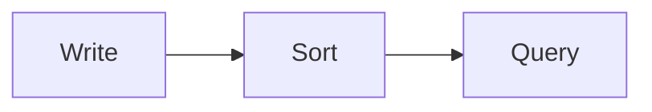

Write your opening paragraph here. It becomes the article lede, so make it
count — no `# H1` needed (the title above is rendered for you; if you keep a
`# Heading` at the very top out of Obsidian habit, it's stripped automatically).

## First section

Use `##` and `###` for sections — they populate the table of contents and get
auto-linked anchors. Keep `#` for the (optional) title only.

Everything below renders on the published site:

- **Code** — fenced blocks are syntax-highlighted (light + dark):

```python
def hello(name: str) -> str:
    return f"Hello, {name}"
```

- **Diagrams** — fenced ` ```mermaid ` blocks render as diagrams:



- **Math** — inline like $O(\log n)$ and display blocks:

$$
C_{\text{plan}} \approx O(n \cdot f)
$$

- **Footnotes** — a claim with a citation.[^1]
- **Tables**, **blockquotes**, **lists**, and **images** (drop an image in the
  same folder and reference it relatively) all render with the site's styling.

[^1]: Footnotes collect at the bottom of the article automatically.
